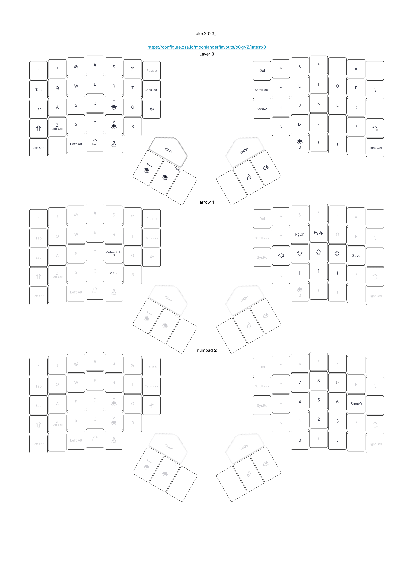
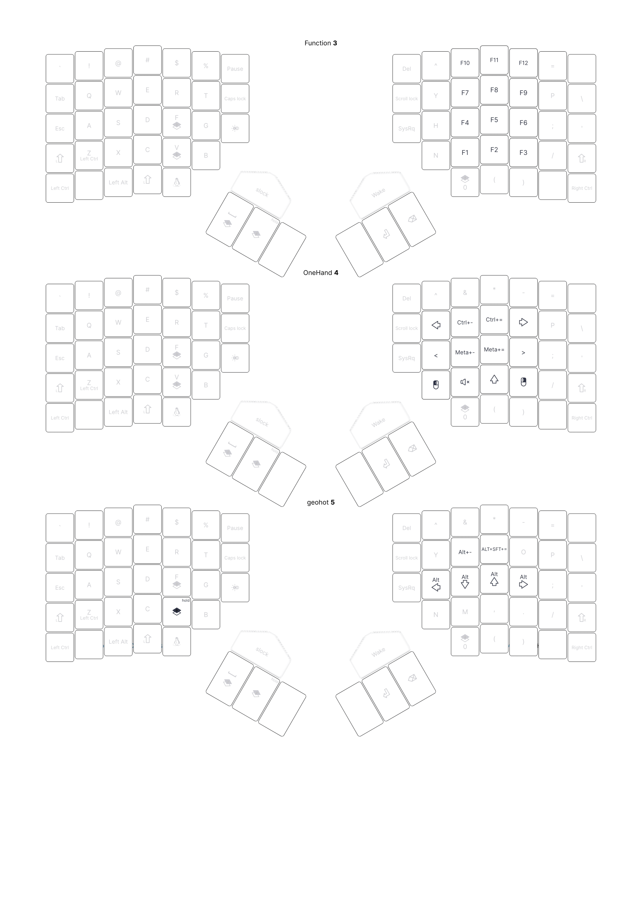

# zsa_moonlander
Keyboard layout for vim and my LARBS fork

[View on ZSA site](https://configure.zsa.io/moonlander/layouts/oGgVZ/latest/0)

Macros
- ctv: Ctrl+C, Ctrl+T, Ctrl+V, Enter. Searchs highlighted text in a new tab
- Save: Esc, :, w, Enter. Save vim
- SandQ: Esc, :, w, q, Enter. Save and quit vim

